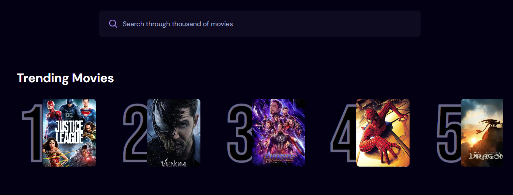
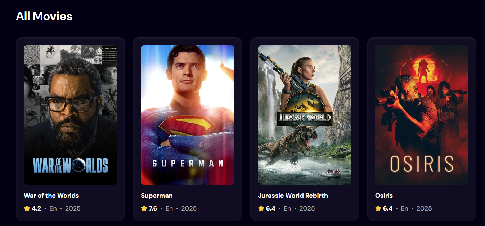

# 🎬 Moodflix

A modern movie discovery app built with **React**, **TMDB API**, and **Appwrite**.  
Browse the latest releases, search with debouncing, and see what’s trending based on community searches.

---

## 🚀 Features

- 🆕 **New Releases** – Home page shows 20 newly released movies.
- 🔍 **Search** – Debounced search for smooth, API-friendly movie lookup.
- 📈 **Trending Movies** – More a movie is searched, higher it appears on the trending list.
- ⚡ **Appwrite Integration** – powers trending logic.
- 🎨 **Responsive UI** – Clean card-based layout for all screen sizes.

---

## 🛠️ Tech Stack

- **Frontend:** React, Vite, Tailwind CSS
- **Backend/Database:** Appwrite
- **API:** TMDB (The Movie Database)

---

## 📸 Screenshots





## 📂 Project Setup

1. Clone the repository:

   ```bash
   git clone https://github.com/Mudasirh120/Moodflix.git
   cd Moodflix

   ```

2. Install dependencies:

   ```bash
   npm install
   ```

3. Create a .env file and add these variables:

   ```bash
   VITE_TMDB_API_KEY="your_tmdb_api_key"
   VITE_APPWRITE_PROJECT_ID="your_appwrite_project_id"
   VITE_APPWRITE_DATABASE_ID="your_appwrite_database_id"
   VITE_APPWRITE_COLLECTION_ID="your_appwrite_collection_id"
   ```

4. Start the server

   ```bash
   npm run dev
   ```

---

**📌 Future Improvements**

- 🎥 Movie detail page (with trailer, cast, ratings)
- ❤️ User accounts with favorites & watchlist
